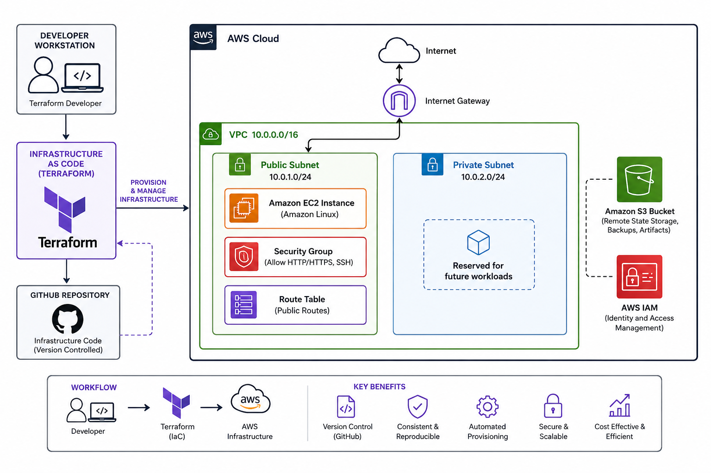

# AWS Terraform Infrastructure


 using Terraform to provision AWS networking resources.

The infrastructure includes:

- VPC
- Public Subnet
- Private Subnet
- Internet Gateway
- Security Group

The goal of this project is to demonstrate AWS infrastructure automation and Terraform best practices.

---

## Architecture



Internet
│
▼
Internet Gateway
│
▼
VPC (10.0.0.0/16)
├── Public Subnet (10.0.1.0/24)
│   ├── EC2 Instance
│   ├── Security Group
│   └── Route Table
│
└── Private Subnet (10.0.2.0/24)

Amazon S3 Bucket


Developer
   │
   ▼
Terraform
   │
   ▼
AWS Cloud

VPC
├── Public Subnet
│   ├── EC2
│   ├── Security Group
│   └── Route Table
│
├── Private Subnet
│
├── Internet Gateway
│
└── S3 Bucket
## Technologies Used

- AWS
- Terraform
- Git
- GitHub

## Project Structure

(project structure)

## Terraform Commands

(terraform commands)

## Future Enhancements

- Route Tables
- EC2
- S3


## Validation

Terraform configuration successfully validated.

```bash
terraform validate

Success! The configuration is valid.

## Skills Demonstrated

- AWS VPC Design
- Infrastructure as Code (Terraform)
- AWS Networking
- Security Groups
- EC2 Provisioning
- S3 Storage
- Route Tables
- Git Version Control
- DevOps Documentation


## Project Status

✅ Complete

Current Infrastructure:

- VPC
- Public Subnet
- Private Subnet
- Internet Gateway
- Route Table
- Route Table Association
- Security Group
- EC2 Instance
- S3 Bucket
## Author

**Babatunde Ayo**

AWS Cloud & DevOps Engineer

📍 Toronto, Ontario, Canada

🔗 LinkedIn: https://linkedin.com/in/babatunde-ayo-devops